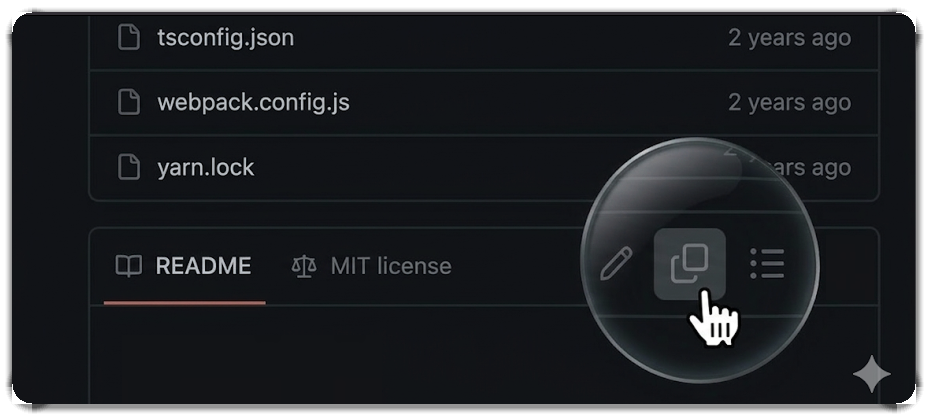

<h1 align="center">Github-Copy-to-LLM</h1>

  

  Chrome extension that adds Copy-to-LLM button to GitHub's README and gists.

## Features

- 📎 Adds missing copy buttons to GitHub's repository READMEs and gists
- 📃 Copies raw markdown instead of rendered page text
- 💅 Uses GitHub-style icons and button styling

## Install Locally

1. Run `npm install && npm run build`
2. Open `chrome://extensions` and enable `Developer mode`
3. Click `Load unpacked` and select the `dist/` folder
